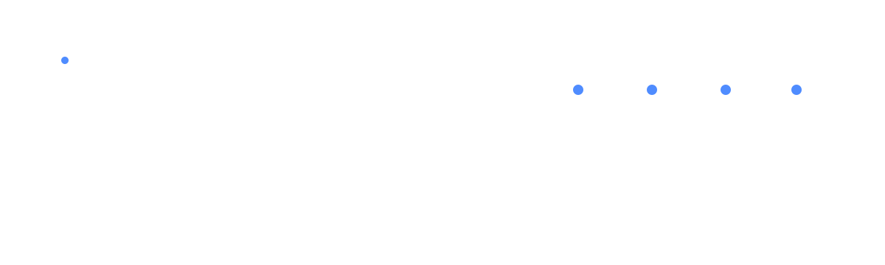

<div align="center">



<br><br>

### SOFTWARE ENGINEER · AI · EMBEDDED SYSTEMS · FIRMWARE

<sub>Building intelligent systems from silicon to software.</sub>

<br><br>

<a href="https://versell.ai">VERSELL.AI</a>
  ·   <a href="https://github.com/Ber4tBey">GITHUB</a>
  ·   <a href="https://t.me/Ber4tbey">TELEGRAM</a>

</div>

<br>

---

<br>

## 01 / PROFILE

I’m **Berat**, a software engineer focused on building products at the intersection of **software, artificial intelligence and embedded systems**.

I work across the entire engineering stack — from firmware and connected hardware to backend infrastructure, AI systems and production software.

```text
IDEA  →  ARCHITECTURE  →  PROTOTYPE  →  FIRMWARE  →  SOFTWARE  →  PRODUCT
```

Currently building **Versell** and **ANOS**.

<br>

---

<br>

## 02 / CURRENTLY BUILDING

<table>
<tr>
<td width="50%" valign="top">

### VERSELL.AI

**AI Customer Communication Platform**

AI-powered customer communication infrastructure designed to automate conversations, workflows and customer interactions.

Versell combines artificial intelligence with communication infrastructure to help businesses build smarter customer experiences.

<br>

**FOCUS**

`Artificial Intelligence`
`LLM Systems`
`Automation`
`Backend Infrastructure`
`SaaS`

<br>

<a href="https://versell.ai"><b>versell.ai →</b></a>

</td>

<td width="50%" valign="top">

### ANOS

**Intelligent Smart Glasses**

A smart glasses platform combining **hardware, firmware, software and artificial intelligence** into a single connected product.

Working across the physical and digital layers — from embedded systems and device communication to the software and intelligence powering the experience.

<br>

**FOCUS**

`Embedded Systems`
`Firmware`
`Wearable Computing`
`Device Communication`
`Artificial Intelligence`

<br>

<b>STATUS / ACTIVE DEVELOPMENT</b>

</td>
</tr>
</table>

<br>

---

<br>

## 03 / ENGINEERING

```text
┌──────────────────────────────────────────────────────────────────────┐
│                                                                      │
│   DEVICE          FIRMWARE          PLATFORM          INTELLIGENCE   │
│     │                 │                 │                  │         │
│     └────────►────────┴────────►────────┴────────►─────────┘         │
│                                                                      │
│   Hardware         Embedded          Backend              AI         │
│   Sensors          Systems           APIs                 LLMs       │
│   Wearables        Connectivity      Infrastructure      Agents      │
│                                                                      │
└──────────────────────────────────────────────────────────────────────┘
```

<br>

<table>
<tr>
<td width="25%" valign="top">

### SOFTWARE

TypeScript
JavaScript
Python
C / C++
SQL

</td>

<td width="25%" valign="top">

### SYSTEMS

Node.js
Linux
Docker
PostgreSQL
Redis

</td>

<td width="25%" valign="top">

### EMBEDDED

Firmware
Microcontrollers
BLE
IoT
Device Communication

</td>

<td width="25%" valign="top">

### AI

LLMs
AI Agents
Automation
AI APIs
Intelligent Workflows

</td>
</tr>
</table>

<br>

---

<br>

## 04 / WHAT I CARE ABOUT

<table>
<tr>
<td width="33%" valign="top">

### PRODUCT ENGINEERING

Turning ideas into real products — not just prototypes.

Architecture, implementation, infrastructure and deployment.

</td>

<td width="33%" valign="top">

### INTELLIGENT SYSTEMS

Building AI into products where it creates actual utility.

LLMs, agents, automation and intelligent workflows.

</td>

<td width="33%" valign="top">

### HARDWARE × SOFTWARE

Engineering beyond the browser.

Firmware, connected devices and software working as one system.

</td>
</tr>
</table>

<br>

---

<br>

<div align="center">

### SOFTWARE × AI × HARDWARE

**Building systems from silicon to software.**

<br>

<sub>BERAT · ISTANBUL, TR</sub>

</div>
